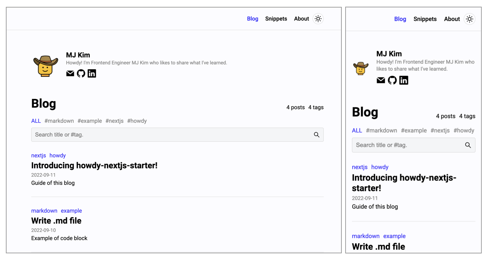
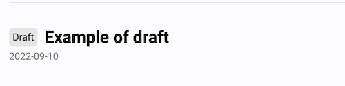

# howdy-nextjs-starter



[Next.js](https://nextjs.org/), [styled-components](https://styled-components.com/)
, [next-mdx-remote](https://github.com/hashicorp/next-mdx-remote)로 만든 블로그 템플릿입니다.

npm `8.1.2`, node `v16.13.1` 버전을 사용했습니다.

### Features

- `.md`와 `.mdx` 지원
- 글을 제목과 태그로 검색
- 코드 하이라이팅과 제목
- 라이트/다크모드 지원
- 댓글 지원 (utterances)
- RSS 피드 등 SEO 지원
- Google Analytics

### Quick Start

1. `config/metaData.ts` 수정
2. `content/posts`나 `content/snippets`에 글 추가
3. [Vercel](https://vercel.com/)에 배포

### Development

아래 명령어로 설치 및 실행합니다.

```shell
# 설치
npm install

# 실행
npm run dev 
```

브라우저에서 http://localhost:3000로 확인이 가능합니다.

## Project structure

```txt
howdy-nextjs-starter/
    ├── config/ 
    │   └── metaData.ts
    ├── content/ // 컨텐츠 추가
    │   ├── about
    │   ├── posts
    │   └── snippets
    ├── public/ // assets 추가
    │   ├── favicons
    │   └── images
    └── styles/ // 스타일 커스텀
        ├── code.style.ts
        ├── globa.style.ts
        ├── prism-dracula.css
        └── theme.style.ts
```

블로그를 개인화하기 위해 필요한 폴더 구조만 나열했으나, 다른 곳도 얼마든지 수정 가능합니다.

### Config

`config/metaData.js`에서 이름, 이메일, Sns 아이디, Ga 아이디 등 사이트 정보나 개인 정보를 수정할 수 있습니다.

페이지의 활성/비활성 설정도 가능하지만, 'Blog' 페이지는 필수입니다.

## Content Frontmatter

```txt
title (required)
date (required)
tags (optional)
lastmod (optional)
draft (optional, if none provided it will be published)
summary (optional)
thumbnailUrl (options)
```

예시:

```txt
title: Write your post with it!
date: '2022-09-12'
tags: [first-post]
lastmod: '2022-09-15'
draft: false
summary: Checkout the howdy-nextjs-starter template
thumbnailUrl: 'https://avatars.githubusercontent.com/u/58619071?v=4'
```

### Draft

`draft: true`로 설정한 컨텐츠라면, 로컬 서버에서는 'Draft' 뱃지가 보입니다.



## 배포 전에 수정해주세요!

- Logo (replace `/public/images/logo.png`)
- Favicon (`/public/favicons`)
- siteUrl (replace `/config/metaData.ts`)

## License

[MIT](LICENSE.md)
